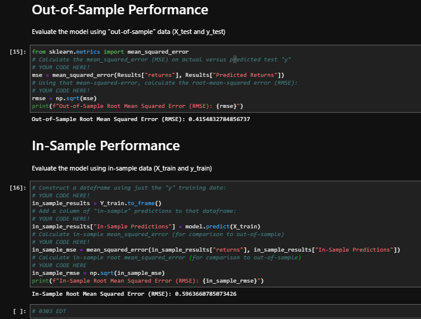

# time_series
time series analysis

# General Introduction

## Time Series

## Time Series Discrepancies

## Regression

## Regression Discrepancies

### X Train Discrepancies

### Root Mean Squared Error (RMSE)

The image directly above is a snipped image from the starter code. The student author focuses on the two values for Out-of-Sample Root Mean Squared Error (RMSE) for In-Sample RMSE. These values conflict somewhat with the student author's answer that is below and pasted.

(Nota Bene: 99.99% of this work comes directly from class material, including and especially the starter notebooks, Instructor GS, Instructor KS, Instructor AN, and Tutor, Ms. LT!)