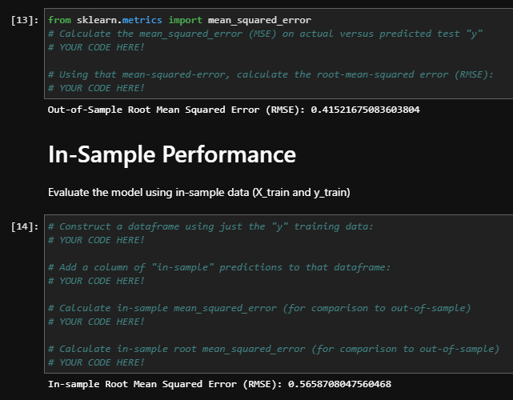

# time_series
time series analysis

# General Introduction

## Time Series

## Time Series Discrepancies

## Regression

## Regression Discrepancies

(Nota Bene: 99.99% of this work comes directly from class material, including and especially the starter notebooks, Instructor GS, Instructor KS, Instructor AN, and Tutor, Ms. LT!)